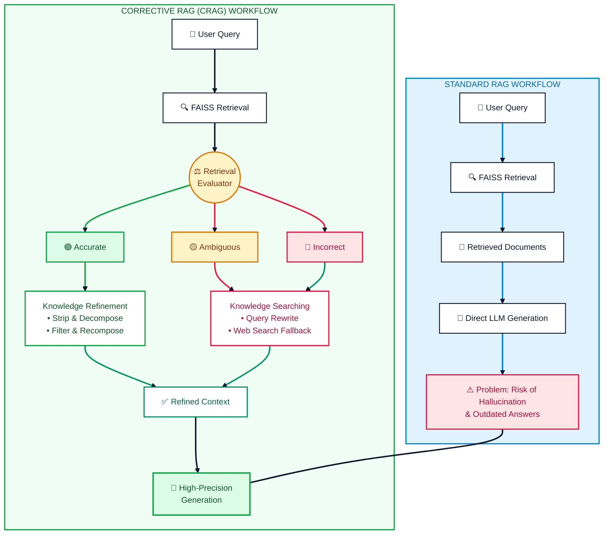
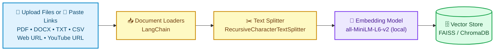
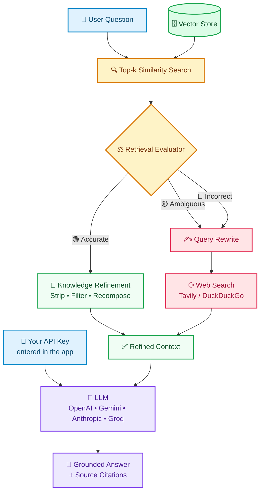

# 🔍 Multi-Format Information Retriever (Corrective RAG)

An advanced, production-grade retrieval framework built to parse, process, and query diverse document formats using **Corrective Retrieval-Augmented Generation (CRAG)** across multiple LLM backends.


<!--
DEMO PLACEHOLDER: add a screenshot or GIF here once you have one, for example:

-->

---

## ✨ Key Features

- **Multi-format ingestion**: Query PDF, Word (DOCX), text, and CSV files in the same session.
- **Web and YouTube support**: Paste a web page URL or a YouTube URL and ask questions about its content.
- **Self-correcting retrieval (CRAG)**: A Retrieval Evaluator checks the retrieved chunks before the LLM sees them.
- **Automatic web search fallback**: When your sources don't contain a good answer, the system rewrites the query and searches the web.
- **Four LLM providers**: Switch between OpenAI, Google Gemini, Anthropic, and Groq from the UI.
- **Bring your own API key**: Keys are entered in the app at runtime, so nothing secret lives in the code.
- **Local embeddings**: Vectors are generated on your machine with Hugging Face models, with no embedding API costs.
- **Source citations**: Answers show which sources were used.

---

## 💡 Importance of This Project

In traditional enterprise settings, knowledge is fragmented across multiple formats—PDF reports, Word documents, text logs, web pages, and CSVs. Standard LLMs suffer from context limits, hallucinations, and outdated information. 

This project solves critical information retrieval challenges by:
- **Eliminating Format Barriers**: Ingesting unstructured and structured files seamlessly without manual preprocessing.
- **Ensuring High Precision**: Using self-corrective retrieval mechanisms so the LLM receives only relevant context.
- **Reducing AI Hallucinations**: Grounding response generation strictly in retrieved document context and dynamic web searches.
- **Providing Multi-Provider Agnosticism**: Enabling seamless switching between OpenAI, Google Gemini, Anthropic, and Groq based on cost and privacy requirements.

---

## 🛠️ Deep Dive: Core Technologies

### 🦜🔗 LangChain
**What it is**: LangChain is an open-source framework designed to simplify the creation of applications using large language models (LLMs). It provides abstractions for document loaders, text splitters, vector stores, and chain orchestration.

**How it is used in this project**:
- Managing document loading pipelines (`PyPDFLoader`, `Docx2txtLoader`, `CSVLoader`, `TextLoader`, plus web page and YouTube loaders).
- Chunking large texts using `RecursiveCharacterTextSplitter`.
- Constructing dynamic prompt templates and chaining retrieval logic with vector stores and LLM generators.

**Dependencies used**:
- `langchain`
- `langchain-community`
- `langchain-core`
- `langchain-text-splitters`

🔗 [LangChain Official Documentation](https://python.langchain.com/)

---

### 🤗 Hugging Face
**What it is**: Hugging Face is an open-source platform and community providing pre-trained deep learning models, datasets, and machine learning utilities, famous for its `transformers` and `sentence-transformers` libraries.

**How it is used in this project**:
- Generating high-dimensional vector embeddings locally using open-source models like `sentence-transformers/all-MiniLM-L6-v2`.
- Running embedding pipelines locally without incurring external API costs or data privacy overheads.

**Dependencies used**:
- `transformers`
- `sentence-transformers`
- `huggingface-hub`

🔗 [Hugging Face Official Documentation](https://huggingface.co/docs)

---

### 👑 Streamlit
**What it is**: Streamlit is a faster way to build and share data apps. It turns Python scripts into interactive web applications in minutes without requiring web development experience (HTML/CSS/JS).

**How it is used in this project**:
- Serving as the interactive user interface for file uploads, vector indexing status, prompt execution, and dynamic LLM provider selection.
- Rendering rich markdown responses, source document citations, and real-time execution logs.

**Dependencies used**:
- `streamlit`

🔗 [Streamlit Official Documentation](https://docs.streamlit.io/)

---

## 🧰 Complete Tech Stack Used

| Category | Technology / Library | Purpose |
| :--- | :--- | :--- |
| **Frontend / UI** | Streamlit | Web interface for multi-file uploading & interactive Q&A |
| **Orchestration** | LangChain | RAG pipeline, chain execution, prompt engineering |
| **Embeddings** | Hugging Face Sentence-Transformers | Local vector embeddings generation |
| **Vector Database** | FAISS / ChromaDB | Fast similarity search and dense vector storage |
| **LLM Backends** | OpenAI, Google Gemini, Anthropic, Groq | Generative response synthesis |
| **Document Loaders** | PyPDF, docx2txt, Pandas, web page and YouTube loaders | Parsing PDF, DOCX, TXT, CSV files, web pages, and YouTube transcripts |
| **Search Fallback** | Tavily / DuckDuckGo Search API | External web search augmentation for CRAG |

---

## 🧠 Not Just Standard RAG: This is Corrective RAG (CRAG)

### How CRAG Beats Standard RAG
Standard RAG blindly passes top-$k$ retrieved vector matches directly to the LLM. If the vector store returns low-quality or irrelevant chunks, standard RAG forces the LLM to hallucinate or generate inaccurate answers.

**Corrective RAG (CRAG)** fixes this by adding a **Retrieval Evaluator**:
1. **Evaluates Relevance**: The evaluator scores how well the retrieved document chunks match the user query.
2. **Corrects & Triggers Fallback**:
   - **Correct**: If retrieved documents are highly relevant, it extracts key knowledge and passes it to the generator.
   - **Incorrect / Ambiguous**: If retrieved documents are insufficient or irrelevant, CRAG dynamically triggers an **external web search** (e.g., via Tavily or DuckDuckGo) to retrieve up-to-date, accurate knowledge.
3. **Refines Context**: Filters out noise before final response generation.



---

## 🏗️ System Architecture

The system works in **two phases**. Phase 1 prepares your documents once. Phase 2 runs every time you ask a question. Each step has one job, so you can swap any piece (for example the vector store or the LLM provider) without touching the rest of the pipeline.

| Layer | What it does | Technology |
| :--- | :--- | :--- |
| **Presentation** | Upload files, choose an LLM provider, enter your own API key, ask questions, view answers with sources | Streamlit |
| **Ingestion** | Reads each file, web page or YouTube video with the right loader and cuts the text into overlapping chunks | LangChain loaders + `RecursiveCharacterTextSplitter` |
| **Embedding & Storage** | Converts chunks to vectors locally and stores them for fast similarity search | Hugging Face `all-MiniLM-L6-v2` + FAISS / ChromaDB |
| **Corrective Retrieval (CRAG)** | Scores retrieved chunks and, when they are weak, rewrites the query and searches the web | Retrieval Evaluator + Tavily / DuckDuckGo |
| **Generation** | Writes the final answer using only the refined context | OpenAI, Gemini, Anthropic or Groq |

### 📥 Phase 1: Document Ingestion & Indexing

This happens once, when you upload your files or paste your links.



### 🔍 Phase 2: Question Answering with Corrective RAG

This happens every time you ask a question.



### 🔄 End-to-End Flow in Plain English

1. **Add Sources**: You upload files (PDF, DOCX, TXT, CSV) or paste a web page URL or a YouTube URL through the Streamlit UI.
2. **Parse & Chunk**: Each source is read and split into small overlapping chunks so no important context is lost at the edges.
3. **Embed & Index**: Chunks become vectors and are saved in the vector store.
4. **Ask**: You type a question and the most similar chunks are retrieved.
5. **Evaluate**: The Retrieval Evaluator decides whether those chunks are good enough to answer the question.
6. **Correct**: If they are not, the system rewrites your query and searches the web for better information.
7. **Generate**: The LLM you chose, using your own API key, answers from the refined context. The app shows which sources were used.

---

## 🚀 Getting Started

Follow these steps to run the project on your own computer.

### ✅ Prerequisites

| Requirement | Details |
| :--- | :--- |
| **Python** | Version 3.9 or higher ([download](https://www.python.org/downloads/)) |
| **Git** | To clone the repository ([download](https://git-scm.com/downloads)) |
| **An LLM API key** | From OpenAI, Google Gemini, Anthropic, or Groq. You enter it inside the app, so no config files are needed |

> 💡 **Tip:** Groq and Google Gemini both offer free tiers, so you can try the project without spending anything.

### 📥 Step 1: Clone the Repository

```bash
git clone https://github.com/gprajwalm10/Multi-Format-Information-Retriver.git
cd Multi-Format-Information-Retriver
```

### 🐍 Step 2: Create a Virtual Environment

A virtual environment keeps this project's libraries separate from the rest of your system.

**Windows**
```bash
python -m venv venv
venv\Scripts\activate
```

**macOS / Linux**
```bash
python3 -m venv venv
source venv/bin/activate
```

### 📦 Step 3: Install Dependencies

```bash
pip install -r requirements.txt
```

> ⏳ The first install can take a few minutes because it downloads `transformers` and `sentence-transformers`. The embedding model (`all-MiniLM-L6-v2`) is also downloaded automatically the first time you run the app.

### ▶️ Step 4: Run the App

```bash
streamlit run app.py
```

Streamlit will open the app in your browser automatically. If it does not, go to **http://localhost:8501**.

### 🔑 Step 5: Enter Your API Key in the App

There is nothing to configure in the code and no `.env` file to create. Once the app opens:

1. Select your LLM provider (OpenAI, Gemini, Anthropic or Groq).
2. Paste your own API key into the API key field.
3. Start uploading documents and asking questions.

> 🔒 Your key is entered at runtime and is never written into the source code, so nothing secret is ever committed to GitHub.

---

## 🧑‍💻 How to Use the App

1. **Choose an LLM provider** and **enter your API key** in the app.
2. **Add your sources**. Upload files, or paste a web page URL or a YouTube URL. You can mix different types in the same session.
3. **Wait for indexing** to finish. The status message tells you when your sources are ready.
4. **Ask a question** in the chat box in plain language. You can ask anything related to the files or links you added.
5. **Read the answer and its sources**. If your sources did not contain enough information, the system will use web search and tell you so.

### 📄 Supported Sources

| Source | Input | Loader Used |
| :--- | :--- | :--- |
| PDF | `.pdf` file upload | `PyPDFLoader` |
| Word | `.docx` file upload | `Docx2txtLoader` |
| Text | `.txt` file upload | `TextLoader` |
| CSV | `.csv` file upload | `CSVLoader` |
| Web page | Paste a website URL | Web page loader (e.g. `WebBaseLoader`) |
| YouTube video | Paste a YouTube URL | YouTube transcript loader (e.g. `YoutubeLoader`) |

> 🎥 **YouTube note:** the video's transcript is what gets indexed, so the video needs captions or subtitles available.

### 💬 Example Questions to Try

- *"Summarise the key findings in the uploaded report."*
- *"What does the CSV say about sales in Q3?"*
- *"Compare what the PDF and the Word document say about the project deadline."*
- *"Summarise the main points of this article."* (after pasting a web page URL)
- *"What does the speaker say about pricing in this video?"* (after pasting a YouTube URL)
- *"What is the latest news about this topic?"* (this triggers the CRAG web search fallback)

---

## 📂 Project Structure

```text
Multi-Format-Information-Retriver/
├── app.py               # Streamlit app: UI, source loading, CRAG pipeline
├── requirements.txt     # Python dependencies
└── README.md            # Project documentation
```

> 📝 Add any other files or folders from the repository here (for example `assets/` for screenshots) with a one-line description each.

---

## 🎯 Key Design Decisions

| Decision | Why |
| :--- | :--- |
| **CRAG instead of standard RAG** | A Retrieval Evaluator filters weak matches before generation, so the LLM is not forced to answer from irrelevant chunks. |
| **Local embeddings (Hugging Face)** | No embedding API costs, and document text is not sent to a third party just to be indexed. |
| **Multiple LLM providers** | Users can choose based on cost, speed, and privacy needs instead of being locked into one vendor. |
| **User-supplied API keys** | The app can be shared or hosted publicly without paying for, or exposing, anyone's usage. |
| **Web search fallback** | When the uploaded sources do not contain the answer, the system can still respond with current information instead of guessing. |

---

## 🛠️ Troubleshooting

| Problem | Solution |
| :--- | :--- |
| `ModuleNotFoundError` | Your virtual environment is not active, or the install failed. Activate it and run `pip install -r requirements.txt` again. |
| `Invalid API key` / `401` error | Re-enter the key in the app. Check for extra spaces and make sure it belongs to the provider you selected. |
| `streamlit: command not found` | Run `python -m streamlit run app.py` instead. |
| First run is very slow | The embedding model is downloading. This only happens once. |
| Port 8501 already in use | Run `streamlit run app.py --server.port 8502`. |
| YouTube link fails to load | The video may not have captions, or it may be private or age-restricted. Try a different video. |
| Web page link returns little or no text | Some sites block scraping or load content with JavaScript. Try another page or copy the text into a `.txt` file. |
| Rate limit or quota error | Your API plan's limit was reached. Wait a moment or try another provider. |

---

## 🤝 Contributing

Contributions, issues and feature requests are welcome!

1. Fork the repository
2. Create your feature branch: `git checkout -b feature/your-feature`
3. Commit your changes: `git commit -m "Add your feature"`
4. Push to the branch: `git push origin feature/your-feature`
5. Open a Pull Request

---

## 👨‍💻 Author

**Prajwal**
- GitHub: [@gprajwalm10](https://github.com/gprajwalm10)

If you found this project useful, please consider giving it a ⭐ on GitHub!
